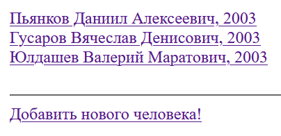

# LibraryWebApp

# Приложение для библиотеки с использованием Spring Framework
Данное приложение создано для того, чтобы облегчить работу для работника библиотеки. В нем он может создавать новые книги и добавлять новых клиентов, редактировать книги и данные клиентов. Ключевой функцией является возможность давать книги человеку и удобно видеть, у какого человека какие книги сейчас на руках. Можно давать человеку несколько книг, после чего освобождать их и давать другим людям.

## Приложение может принимать следующие запросы:

1. GET: / - навигационная страница, с которой можно попасть либо на страницу со всеми клиентами, либо на страницу со всеми книгами
2. GET: /people - отображение краткой информации обо всех клиентах библиотеки. При нажатии на клиента будет выполнен переход на страницу с подробной информацией о нем
3. GET: /people/new - отображение формы для создания нового клиента
4. GET: /people/{id}/edit - отображение формы для редактирования существующего клиента
5. GET: /books - отображение краткой информации обо всех книгах в библиотеке. При нажатии на книгу будет выполнен переход на страницу с подробной информацией об этой книге
6. GET: /books/new - отображение формы для создания новой книги
7. GET: /books/{id}/edit - отображение формы для редактирования новой книги
8. GET: /people/{id} - подробная информация о человеке с указанным id и отображение списка всех книг, которые он взял (на каждую книгу из списка можно нажать и перейти на страницу этой книги). Если у человека нет книг, то эта информация будет выведена. Можно перейти на страницу редактирования человека или удалить человека
9. GET: /books/{id} - подробная информация о книге с указанным id и отображение человека, который сейчас владеет книгой. Если книгой никто не владеет, будет предложен выбор человека, которому эту книгу можно назначить из списка всех людей. Если книгой кто-то владеет, то можно освободить книгу или перейти на страницу этого человека. Можно перейти на страницу редактирования книги или удалить книгу
10. POST: /people - добавление нового человека в базу данных
11.  PATCH: /people/edit - редактирование существующего человека
12.  DELETE: /people/{id}  - удаление существующего человека
13.  POST: /books - добавление новой книги
14.  PATCH: /books/add_owner/{id} - добавление владельца книге
15.  PATCH: /books/remove_owner/{id} - удаление владельца у книги
16.  PATCH: /books/{id} - редактирование существующей книги
17.  DELETE: /books/{id} - удаление существующей книги
18.  При обращении на любой другой адрес, будет выведена кастомная страница с ошибкой

## Стек технологий:

- Java
- Spring Framework + Spring MVC
- JDBC Template
- PostgreSQL
- Thymeleaf
- Также в проекте использовался Spring Validator для того, чтобы сообщать о некорректно введенных полях при создании или редактировании объектов

## Информация о БД:

База данных PostgreSQL имеет две таблицы (отношение One to many): Person и Book. В таблице настроено каскадирование: при удалении человека все его книги становятся свободными

- Таблица Person:

```sql
create table person
(
    person_id int generated by default as identity primary key,
    fullname varchar not null unique check ((length((fullname)) >= 8) AND (length((fullname)) <= 50)),
    yearofbirth int not null check ((yearofbirth >= 1940) AND (yearofbirth <= 2022))
);
```

- Таблица Book:

```sql
create table book
(
    book_id int generated by default as identity primary key,
    person_id int references person(person_id) on delete set null,
    title varchar not null check ((length((title)) >= 4) AND (length((title)) <= 50)),
    author varchar not null check ((length((author)) >= 4) AND (length((author)) <= 50)),
    yearofpublishing integer not null check ((yearofpublishing >= 1700) AND (yearofpublishing <= 2022))
);
```

# Интерфейс приложения

1. /people



2. /people/{id} (если человек еще не брал книг)


3. /people/{id}/edit (пример с неправильно введенным полем)


4. /people/new (пример с неправильно введенными полями


5. /books


6. /books/{id} (если книга свободна)


7. /books/{id}/edit (пример с неправильно введенными полями)


8. /people/{id} (если у человека есть книги)


9. /books/{id} (если у книги есть владелец)


